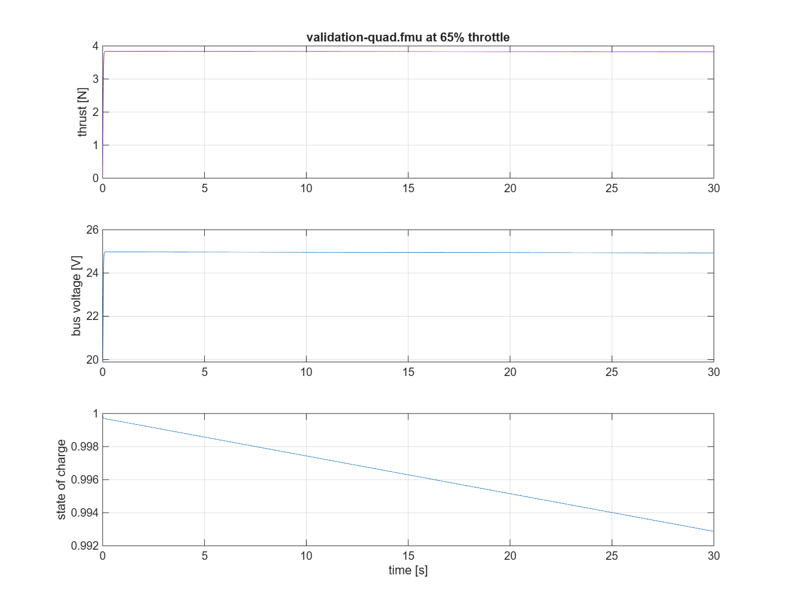

# Simulink co-simulation

`run_fmu_simulink.m` builds a Simulink model programmatically, imports the
bundled quadcopter FMU, commands a fixed throttle on every rotor, and runs
FMI 3.0 Co-Simulation. It plots thrust, bus voltage, and battery state of
charge to `fmu_cosim.png`.



## Requirements

MATLAB + Simulink, verified on R2025a. No toolboxes beyond Simulink are
required.

## Run it

From this folder:

```sh
matlab -batch "run('run_fmu_simulink.m')"
```

Or open `run_fmu_simulink.m` in MATLAB and run it interactively.

## FMU import gotchas

Three things that will silently ruin the model if changed:

- The FMU Import block lives in the Simulink Extras library
  (`'simulink_extras/FMU Import/FMU'`), NOT in User-Defined Functions.
- The block wants a BARE file name with the FMU's folder on the MATLAB
  path — a full path in `FMUName` is not accepted.
- Every FMU output you care about must be wired to a root Outport;
  unconnected outputs are removed by block reduction and the simulation
  proves nothing about them.

Port order follows the FMU's `modelDescription.xml` declaration order and is
the same for every ThrustLab export regardless of rotor count. The full
input and output list is in the script header.

## Use your own FMU

Export an FMU from a completed simulation through **Share → Export FMU** or
`client.fmu`. Put its folder on the MATLAB path, then set `FMU_FILE` to the
bare archive name and `N_ROTORS` to its rotor count in
`run_fmu_simulink.m`.

## The bundled FMU

This example ships with a quadcopter FMU exported from ThrustLab
(`../validation-quad.fmu`). The exact powertrain it reproduces is documented
in the archive's own `resources/README.md`; unzip the FMU to read it. An
equivalent export will fly this example identically.
